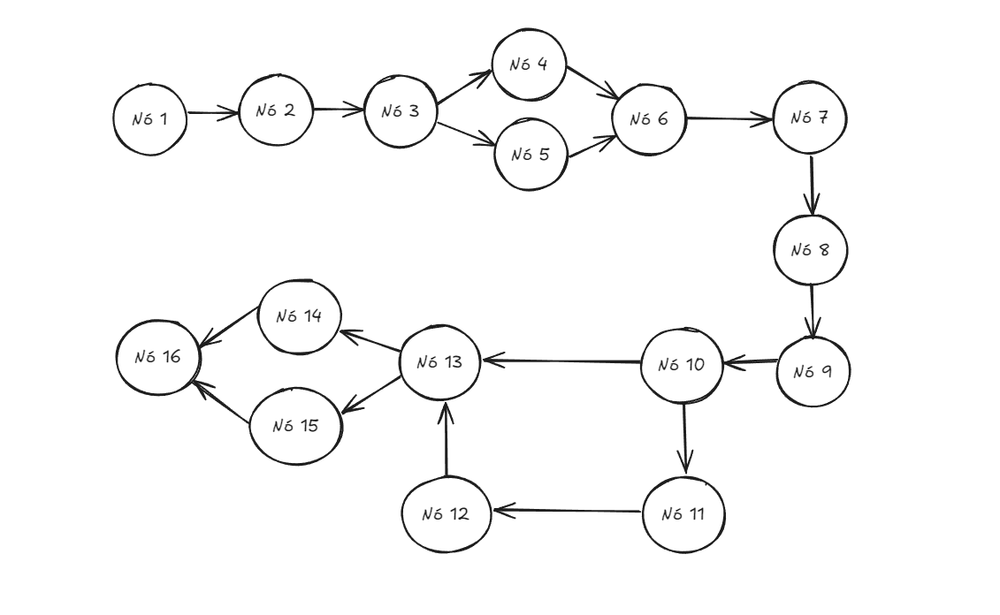
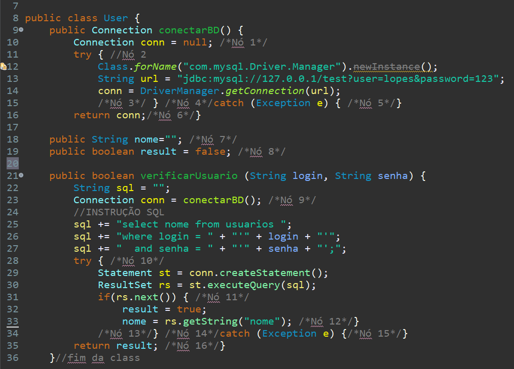

# **Etapa 3: Critérios de Caixa Branca - (Grafo de Fluxo; Complexidade Ciclomática; Base de Caminhos)**

## Descrição da Etapa : 

 Esta etapa requer que seja avaliado o código para definir os caminhos possíveis ao executar o programa. Devem ser realizadas as atividades listadas a seguir:

##  1 - Montar um grafo de fluxo com nodos e arestas

## 2 - Calcular a complexidade ciclomática

M = E − N + 2P

• Arestas (E) = 18
• Nós (N) = 16
• P = 1

M = 18 - 16 + (2.1)
M = 2 + 2

M = 4

##  3 -  Caminhos Possíveis

• Caminho 1 : N1 → N2 → N3 →N4 → N6 → N7 → N8 → N9 → N10 → N11 → N12 → N13 → N14 → N16

• Caminho 2 : N1 → N2 → N3 →N5 → N6 → N7 → N8 → N9 → N10 → N11 → N12 → N13 → N14 → N16

• Caminho 3 : N1 → N2 → N3 →N4 → N6 → N7 → N8 → N9 → N13 → N14 → N16

• Caminho 4 : N1 → N2 → N3 →N4 → N6 → N7 → N8 → N9 → N13 → N15 → N16

## Código com a descrição de cada um dos nós

