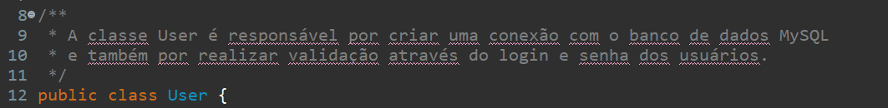

# Etapa 4 : Documentação

## Descrição da Atividade

Esta etapa requer que seja documentado cada uma das funcionalidades presentes no código fornecido. Após criar a documentação é necessário gerar um Javadoc.

## Classe User :

## Método "conectarBD()" :

## Atributos da classe :

## Método "verificarUsuario(String login, String senha)" :

